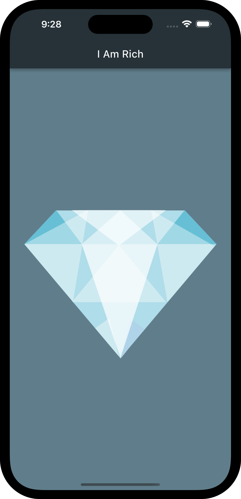

# Flutter Apps Collection
A collection of Flutter apps developed during The App Brevery course

## 1. I Am Rich App

 I Am Rich was a smartphone application developed in 2008 by a German programmer named Armin Heinrich. The app was available for the iPhone at a price of $999.99 and consisted of a fixed screen with a shimmering red diamond at the center and a label reading "I Am Rich" at the top of the screen.

The app had no real function and did nothing more than display the fixed screen, so it was not possible to use it for anything other than viewing the "I Am Rich" label and diamond. Despite the app's lack of real purpose, it was downloaded by a handful of users, some of whom claimed that they purchased it simply to show off their wealth and status. The app was eventually removed from the App Store by Apple after only a day of availability.

