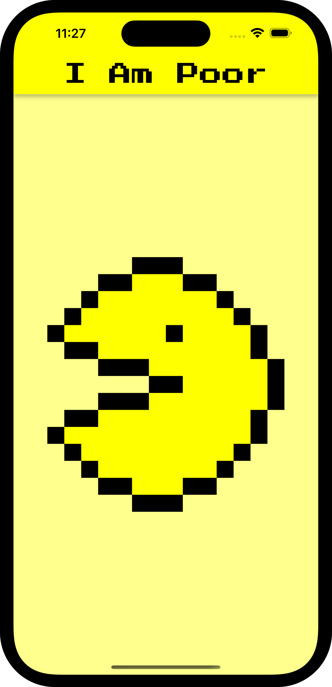
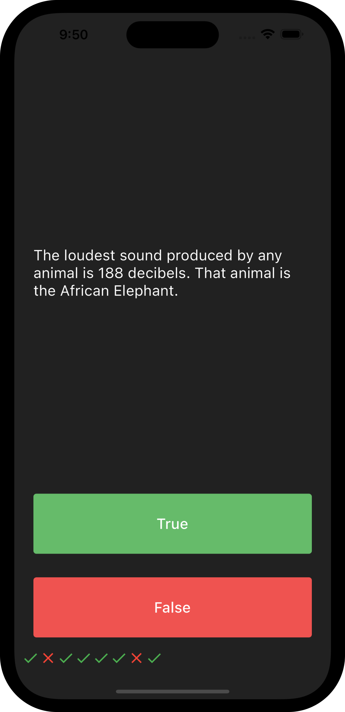
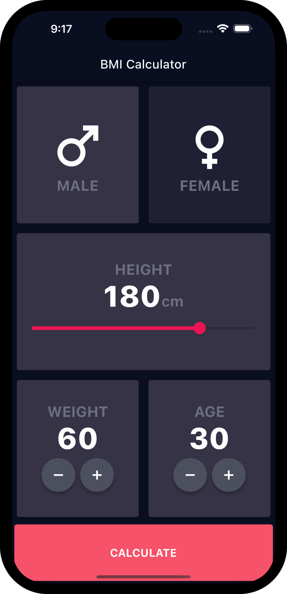

# Flutter Apps Collection
A collection of Flutter apps developed during The App Brevery course

## 1. I Am Rich App

 I Am Rich was a smartphone application developed in 2008 by a German programmer named Armin Heinrich. The app was available for the iPhone at a price of $999.99 and consisted of a fixed screen with a shimmering red diamond at the center and a label reading "I Am Rich" at the top of the screen.

The app had no real function and did nothing more than display the fixed screen, so it was not possible to use it for anything other than viewing the "I Am Rich" label and diamond. Despite the app's lack of real purpose, it was downloaded by a handful of users, some of whom claimed that they purchased it simply to show off their wealth and status. The app was eventually removed from the App Store by Apple after only a day of availability.

## 2. I Am Poor App

 The I Am Rich App, but my custom poor version.

## 3. Mi Card App

 A simple app with my avatar and contacts designed using Card and ListTile widgets.

## 4. Dice App

 Roll the dice on user tap. Stateful Widgets usage.

## 5. Magic 8 Ball App

Do you want to answer a question? Use Magic 8 Ball App!

## 6. Xylophone

Xylophone simulation using a Flutter package to play sounds.

## 7. Quizzler

Quiz app with score keeper

## 7. Destini

Story app with navigation graph

## 8. BMI Calculator

A beautiful app to calculate BMI

## 8. Clima

Weather app showing data retrieved using OpenWeather API (https://openweathermap.org/api) and Localization Feature

## 9. Coin Ticker

Currency conversion to crypto (Bitcoin, Ethereum, etc.)  
https://www.coinapi.io

## 10. Flash Chat

A chat app built on Firebase using Authentication and Database Firestore.

## 11. Todoey

Todo tasks

